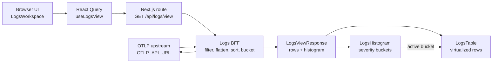
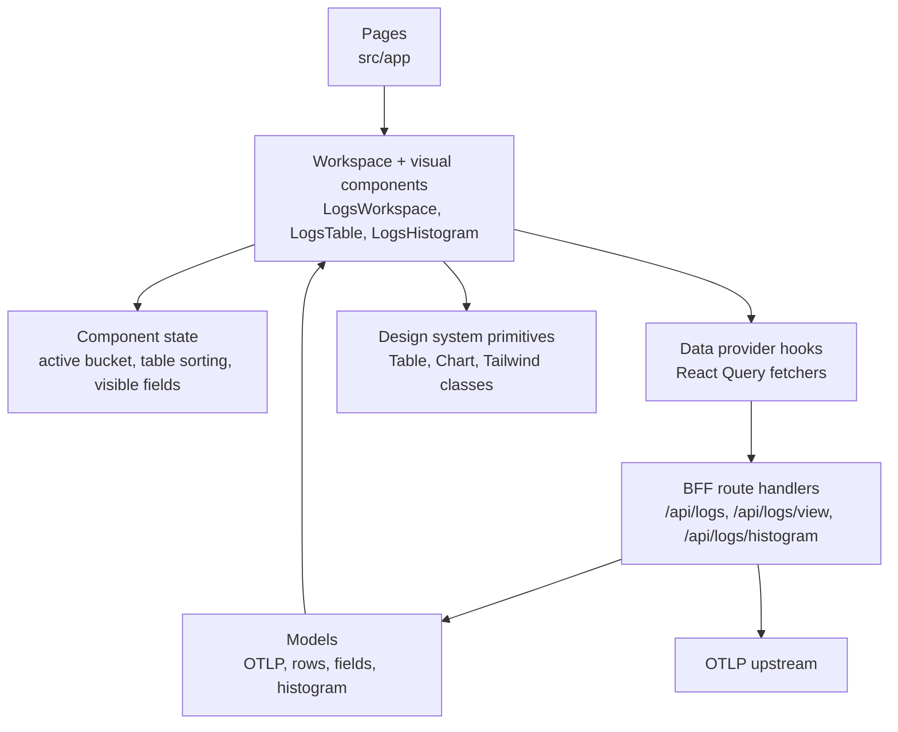

# Guioncero

Guioncero is a simple OTLP log viewer focused on debugging clarity, usability,
and performance. The app keeps the UI responsive while turning raw OTLP log
payloads into a compact table and severity-aware histogram.

Live version: https://guioncero-app.vercel.app/

## Highlights

- BFF-backed OTLP ingestion through `OTLP_API_URL`, keeping upstream concerns off
  the client.
- Typed model contracts for OTLP payloads, log rows, histogram buckets, and view
  responses.
- React Query data loading with loading, retry, empty, and error feedback in the
  main log workspace.
- Virtualized and sortable log table for larger payloads without rendering every
  row.
- Histogram/table correlation: hovering a histogram bucket highlights matching
  table rows with severity color.
- Persisted user preferences for visible columns and table sorting through
  Zustand.

## How It Works

The main UI requests a single combined view from the BFF. The BFF fetches the
configured OTLP upstream, flattens resource/scope/log records, applies filters
and selected fields, then returns table rows and histogram buckets built from the
same source payload.



The frontend is split into small layers so data fetching, presentation logic,
and visual components can evolve independently.



## API Surface

- `GET /api/logs` returns transformed log rows.
- `GET /api/logs/view` returns log rows and histogram data from one upstream
  payload.
- `GET /api/logs/histogram` returns histogram buckets for the current query.

Set `OTLP_API_URL` to the upstream OTLP JSON endpoint used by the BFF.

## Tech Stack

- Next.js
- React
- TypeScript
- Tailwind CSS
- shadcn/ui primitives
- TanStack Query, Table, and Virtual
- Recharts
- Zustand
- Vitest
- Vercel

## Getting Started

Create an environment file from the example and configure the OTLP upstream:

```bash
cp .env.example .env.local
```

```bash
npm install
npm run dev
```

Open http://localhost:3000.

## Scripts

- `npm run dev` starts the local Next.js server.
- `npm run lint` runs ESLint.
- `npm run test` runs the Vitest suite.
- `npm run typecheck` runs TypeScript without emitting files.
- `npm run build` creates a production build.
